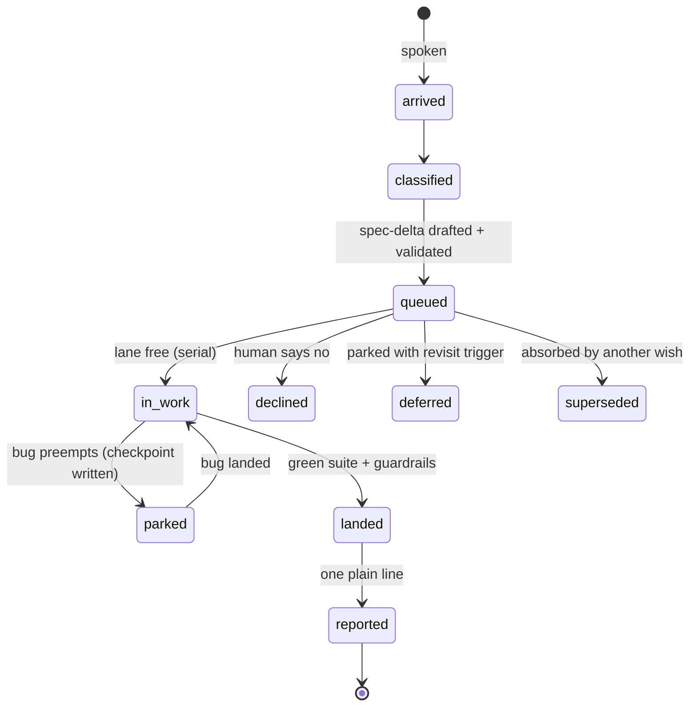

# live-spec — a continuous, self-proving Agentic Development Life Cycle

A continuous, self-proving development pipeline for building with AI agents: throw wishes in passing; each enters a proven process — spec-delta, validation with few batched questions, tests at the right layer, mechanical guardrails, milestone audits.

**Status:** the package release number lives in `VERSION` (one home, never pinned in prose — a pinned copy only drifts). Two counters exist by design: `VERSION` counts package RELEASES; the `SPEC.md` header carries the spec's own document-revision number, which runs ahead because the spec is edited more often than the package ships. Six skills (the shared rulebook plus five working ones), templates, adoption procedure, self-hosted spec + queue; method proven in production on track-coach (700+ tests, 30-widget library). MIT.

**Lost in the folders?** [`OVERVIEW.md`](OVERVIEW.md) is the one-page map: what lives where (the pack, a
user's personal layer, a host project) and where any given rule goes.

---

## Why live-spec, when [BMAD](https://github.com/bmad-code-org/BMAD-METHOD), [spec-kit](https://github.com/github/spec-kit) and [Kiro](https://kiro.dev) exist

They are good, and they share the right instinct: spec before code. Use them if their shape fits your work.
live-spec is built for a different shape of work — **continuous**: you throw wishes in passing, mid-anything,
and each one enters the process in a sentence, not a planning session; the queue is persistent across
sessions; execution runs asynchronously while you keep talking.

Honest lineage notes. Baseline snapshot-diffing is mature testing practice (Jest snapshots, Percy,
Chromatic). Declared-scope enforcement for agents exists too — [agent-guardrails](https://github.com/logi-cmd/agent-guardrails)
diffs a run's actual changes against a per-task file declaration; credit where due. live-spec's one claim is
the **integration**: the spec is the single authority binding the whole loop — intake validates every wish
against it, scope declarations derive from it (not from an ad-hoc brief), a prover skill formally reviews
it, adoption reverse-generates it from an existing codebase, and the development process itself is specced
and proven the same way (this repo's own SPEC.md went through product-prover before its first publish —
findings in `docs/prover/`). Our July-2026 survey — 7 frameworks plus a long-tail skill-ecosystem search —
found that integration nowhere; the raw notes are in [`docs/prior-art.md`](docs/prior-art.md). If you know
prior art we missed, open an issue — we would genuinely like to read it.

An independent look, July 2026: two clean-context analysts — briefed to verify this repo's claims
against its actual files and to criticize all three subjects — compared live-spec with BMAD and Kiro,
and three more read Spec Kit, OpenSpec, GSD and BMAD at source level. Their verdicts are published
unsoftened, including the uncomfortable parts: this project is young and single-author, its
"production-proven" evidence largely belongs to a sibling project, and its judgment loop is one model
reviewing itself — only the mechanical gates are independent. Full texts:
[the comparison](docs/research/2026-07-06-bmad-kiro-livespec-comparison.md) and
[the implementation-level harvest](docs/research/2026-07-06-neighbours-implementation-harvest.md).
The one distinction both analysts confirmed by RUNNING things rather than reading claims: live-spec's
traceability and freshness gates are executable scripts that block a push, while the surveyed
alternatives enforce their specs by prompt text (Spec Kit's consistency checks, analyze and converge
included, are LLM instructions — the only mechanical checks in its repo are file-existence tests).
Six mechanisms the neighbours genuinely do better are queued to be absorbed (queue rows 110–115).

The sharpest critique arrived the same week from use, not review: the first real project built under
the pack — a photo-portfolio site — reported that while no written promise ever regressed, everything
that felt unfinished lived where the method wasn't looking. It specced SURFACES, not the visitor's
PATH (nobody asked "and where does the guest go from here?"); verify-by-deed confirmed "works", never
"feels"; taste defaults accumulated silently until the product read eighty-percent-finished
everywhere. This converges with the analysts' structural critique, so we treat it as the strongest
entry in this section. The gap is now the pack's own shipped work — a product-fit interrogation on
every incoming feature, a visitor-walk and feel pass at verify (scaled to the medium: a site walks
motion, a book walks its reading path), and landing reports that state every taste choice plainly,
marked tweakable, never asking for confirmation (pack releases 0.8.28–0.8.29, July 2026). A
retroactive walk of these lenses over the pack's own ten shipped features closed two more holes the
same day; the first run on a real incoming feature is still ahead — this paragraph will be updated
with how it goes.

---

## The pipeline

**Step 0 — Intake.** A wish arrives in plain words. Name its DOOR aloud before any code — feature · bug · refactor · docs-only · skip (a removal of a shipped feature enters as a change with its own sweep). Hard tripwires, not judgment: a new user-visible surface, new state, a new interaction, or touching a spec-`[target]` surface makes it a FEATURE however casually it was asked; a request to merely see/try something lives only in a labelled `prototype/` home, never in prod (SPEC T-12, INV-16, E-17). A wish too big for its worth is negotiated in **scope** — cut surfaces or split into stages — never in time budgets or estimates (SPEC T-15). A story's declared mockup-first entry condition ("show me first, then build") is written in its queue row and cancelled only by the human naming it — a general "go build" never cancels it (SPEC INV-43).

1. **Spec** (`spec-author`). Write or grow `SPEC.md`: entities, states, transitions, actors, invariants, cross-section composition across every view/mode/tier axis. One surface, one name. A feature's delta opens with **regression fences** when it touches a live surface (what must keep working, each citing the clause it guards — SPEC T-14), walks the **standard-facet sweep** (phone/touch/empty-error-loading/a11y/perf/visual-hierarchy/two-windows/missing-source — every facet ends as a spec sentence, decided or `[default]`-tagged and reported, SPEC T-13/INV-18), and closes with **non-goals** and a **success measure** (SPEC INV-20/INV-21). The document itself reads use-case-first — scenarios of what the human does and sees lead, the formal handles trail as bracketed anchors, a formal index closes the doc (live-spec's own `SPEC.md` is the reference shape).
2. **Prove** (`product-prover`). Review the whole spec with formal-verification thinking. Findings recorded in `docs/prover/`. Fold every must-fix; surface the open decisions.
3. **Architecture.** Write or update `ARCHITECTURE.md` from the proven spec: named nodes, one responsibility each, every spec fact owned by exactly one node, named seams. In a live codebase every node pins to its owning place — the named thing first, the `:line` as a cached convenience a drift gate re-checks — this is where the spec is reconciled with shipped reality (fix the spec to the truth, not the other way).
4. **Prove the architecture** (`product-prover`, architecture lens) whenever the doc changed: every fact has an owning node, no node without spec backing, every seam named.
5. **Test spec.** DERIVE `TEST_MATRIX.md` from the proven spec through the proven architecture: rows organized node × fact, each pinned to a test level (string / DOM / browser / pixel); visibility and layout facts get level ≥ browser; derivation closes with a coverage-validation checklist actually walked.
6. **Test.** Write tests that assert the real shipped artifact — rendered widget, produced file, called function. Watch each new test fail first.
7. **Code.** Implement until green. Delegate well-scoped mechanical work; keep judgment on the senior model. A surface whose spec clause cites an approved prototype (`norm: <path>`, the artifact frozen into `docs/norms/`) is built with that artifact OPEN, and the landing records a one-line plan-vs-prototype diff (SPEC INV-43).
8. **Verify by deed.** Run it and see the result. Green = zero failures AND the skip-set is exactly the expected list.
9. **Commit and show.** Commit when green. Docs travel with the change. Show the real render; push only after the human has reviewed it.

Bug shortcut: `bug → matrix → test → code` (skip spec/prove if the fact is already in SPEC; update the spec sentence if it isn't).


### The life of a wish



### How you drive it

No CLI — you drive it in plain words, in your Claude session:

| You say | What happens |
|---|---|
| *"attach live-spec to this project"* (new) | templates copied, version-control gate, queue starts |
| *"attach live-spec — existing project, adopt"* | orient (reads ALL your docs first) → inventory → re-engineer → attic → baseline |
| any wish, in passing, mid-anything | intake: queue row + spec-delta + only YOUR questions back, batched |
| *"status"* | position on the map: what landed, what's in the lane, what waits on you |
| *"publish / push"* | your gate — nothing outward-facing moves without your word |

---

## The six skills

| Skill | Role |
|---|---|
| `live-spec-base` | The shared rulebook — the working rules every pack skill references (stated once, so copies can't drift) plus the settings ladder: package defaults → personal profile (about you: language, proactivity) → per-host override, every override written down, never silent |
| `spec-author` | Writes and grows the living spec — entities, states, transitions, actors, invariants, cross-section composition |
| `product-prover` | Reviews the whole spec with formal-verification thinking — finds gaps, contradictions, missing invariants. Also maintained as a [standalone repo](https://github.com/happysasha18/product-prover) — it works on any product document, no pipeline required |
| `build-pipeline` | Sequences all the steps — the orchestrator that runs the full arc from wish to shipped, tested, committed change |
| `communicator` | Makes the human exchange land — how to show work, batch decisions, ask only what the human can actually decide |
| `publish` | The publish-quality gate — what a deposit owes per artifact kind (commands for a skill, real runs for a tool, fresh screenshots for a visual product), with publish targets plugging in their own steps |

### Standalone mirrors

Some skills also exist as their own read-only repos under the same account (for example, `product-prover`
above), so someone who only wants that one skill doesn't need the whole pack. This repo stays the single
source — those repos are synced copies, kept current by `scripts/sync-mirrors.sh` whenever the pack is
pushed.

---

## Install

```bash
./install.sh
```

Skills land in `~/.claude/skills/`, available in every project on the machine. Existing skills are backed up with a timestamp before anything is overwritten.

**Staying current:** once a day, a session's freshness walk runs `scripts/check-pack-update.sh` — it asks this repo's public `VERSION` whether the pack has moved past what your machine runs, and if so it *proposes* the update (what changed + the install road). It never installs anything by itself; updating is always your word.

**Attach to a new project:** start from `templates/` — copy the template files you need into your project root.

**Attach mid-flight** (existing codebase, no spec yet): follow `adopt/ADOPT.md` — inventory the code, reverse-spec from what ships, pin the architecture to the real files, derive the test matrix from there.

---

## Project status

- Published and self-hosted: this repo runs on its own method — own `SPEC.md` (use-case-first, prover-proven; every push preceded by a recorded prover re-check in `docs/prover/`), own queue (`ROADMAP.md`), own journal
- Method proven in production: track-coach — 700+ tests, 30-widget library, running since 2025
- First real adoption run completed on a live host (2026-07-04); guardrails scaffold and snapshot machinery are the next major queued items (see ROADMAP)

---

## License

MIT. Copyright Alexander Abramovich 2026.

---

Built by Alexander Abramovich with Claude. Sibling product: [track-coach](https://github.com/happysasha18/track-coach).
