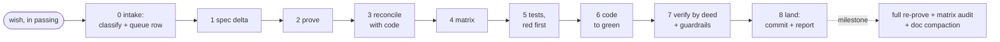
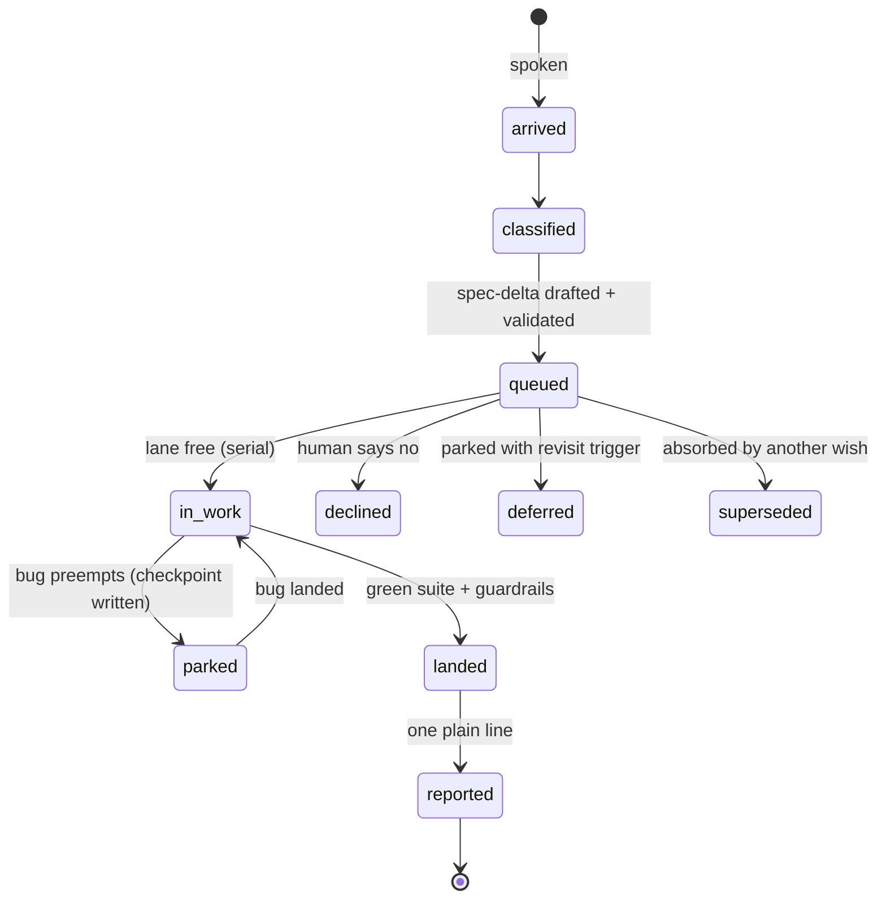

# livespec — a continuous, self-proving Agentic Development Life Cycle

A continuous, self-proving development pipeline for building with AI agents: throw wishes in passing; each enters a proven process — spec-delta, validation with few batched questions, tests at the right layer, mechanical guardrails, milestone audits.

**Status:** v0.1.0 (see `VERSION`) — five skills, templates, adoption procedure, self-hosted spec + queue; method proven in production on track-coach (700+ tests, 30-widget library). MIT.

---

## Why livespec, when [BMAD](https://github.com/bmad-code-org/BMAD-METHOD), [spec-kit](https://github.com/github/spec-kit) and [Kiro](https://kiro.dev) exist

They are good, and they share the right instinct: spec before code. Use them if their shape fits your work.
livespec is built for a different shape of work — **continuous**: you throw wishes in passing, mid-anything,
and each one enters the process in a sentence, not a planning session; the queue is persistent across
sessions; execution runs asynchronously while you keep talking.

Honest lineage notes. Baseline snapshot-diffing is mature testing practice (Jest snapshots, Percy,
Chromatic). Declared-scope enforcement for agents exists too — [agent-guardrails](https://github.com/logi-cmd/agent-guardrails)
diffs a run's actual changes against a per-task file declaration; credit where due. livespec's one claim is
the **integration**: the spec is the single authority binding the whole loop — intake validates every wish
against it, scope declarations derive from it (not from an ad-hoc brief), a prover skill formally reviews
it, adoption reverse-generates it from an existing codebase, and the development process itself is specced
and proven the same way (this repo's own SPEC.md went through product-prover before its first publish —
findings in `docs/prover/`). Our July-2026 survey — 7 frameworks plus a long-tail skill-ecosystem search —
found that integration nowhere; the raw notes are in [`docs/prior-art.md`](docs/prior-art.md). If you know
prior art we missed, open an issue — we would genuinely like to read it.

---

## The pipeline

**Step 0 — Intake.** A wish arrives in plain words. Classify it (new feature / bug / refactor / removal / docs). Determine where it enters the pipeline.

1. **Spec** (`spec-author`). Write or grow `SPEC.md`: entities, states, transitions, actors, invariants, cross-section composition across every view/mode/tier axis. One surface, one name. The document itself reads use-case-first — scenarios of what the human does and sees lead, the formal handles trail as bracketed anchors, a formal index closes the doc (livespec's own `SPEC.md` is the reference shape).
2. **Prove** (`product-prover`). Review the whole spec with formal-verification thinking. Findings recorded in `docs/prover/`. Fold every must-fix; surface the open decisions.
3. **Reconcile.** Map every spec claim to a real `file:line`. Spec drifts from code; fix the spec to the shipped truth, not the other way.
4. **Matrix.** Derive `TEST_MATRIX.md` from the proven spec. One row per invariant/state/transition, each pinned to a test level (string / DOM / browser / pixel). Visibility and layout facts get level ≥ browser.
5. **Test.** Write tests that assert the real shipped artifact — rendered widget, produced file, called function. Watch each new test fail first.
6. **Code.** Implement until green. Delegate well-scoped mechanical work; keep judgment on the senior model.
7. **Verify by deed.** Run it and see the result. Green = zero failures AND the skip-set is exactly the expected list.
8. **Commit and show.** Commit when green. Docs travel with the change. Show the real render; push only after the human has reviewed it.

Bug shortcut: `bug → matrix → test → code` (skip spec/prove if the fact is already in SPEC; update the spec sentence if it isn't).



### The life of a wish



### How you drive it

No CLI — you drive it in plain words, in your Claude session:

| You say | What happens |
|---|---|
| *"attach livespec to this project"* (new) | templates copied, version-control gate, queue starts |
| *"attach livespec — existing project, adopt"* | orient (reads ALL your docs first) → inventory → re-engineer → attic → baseline |
| any wish, in passing, mid-anything | intake: queue row + spec-delta + only YOUR questions back, batched |
| *"status"* | position on the map: what landed, what's in the lane, what waits on you |
| *"publish / push"* | your gate — nothing outward-facing moves without your word |

---

## The five skills

| Skill | Role |
|---|---|
| `livespec-base` | The shared rulebook — the working rules every pack skill references (stated once, so copies can't drift) plus the settings ladder: package defaults → personal profile (about you: language, proactivity) → per-host override, every override written down, never silent |
| `spec-author` | Writes and grows the living spec — entities, states, transitions, actors, invariants, cross-section composition |
| `product-prover` | Reviews the whole spec with formal-verification thinking — finds gaps, contradictions, missing invariants. Also maintained as a [standalone repo](https://github.com/happysasha18/product-prover) — it works on any product document, no pipeline required |
| `build-pipeline` | Sequences all the steps — the orchestrator that runs the full arc from wish to shipped, tested, committed change |
| `communicator` | Makes the human exchange land — how to show work, batch decisions, ask only what the human can actually decide |

---

## Install

```bash
./install.sh
```

Skills land in `~/.claude/skills/`, available in every project on the machine. Existing skills are backed up with a timestamp before anything is overwritten.

**Attach to a new project:** start from `templates/` — copy the template files you need into your project root.

**Attach mid-flight** (existing codebase, no spec yet): follow `adopt/ADOPT.md` — inventory the code, reverse-spec from what ships, build the test matrix from there.

---

## Project status

- Published and self-hosted: this repo runs on its own method — own `SPEC.md` (use-case-first, prover-proven; every push preceded by a recorded prover re-check in `docs/prover/`), own queue (`ROADMAP.md`), own journal
- Method proven in production: track-coach — 700+ tests, 30-widget library, running since 2025
- First real adoption run completed on a live host (2026-07-04); guardrails scaffold and snapshot machinery are the next major queued items (see ROADMAP)

---

## License

MIT. Copyright Alexander Abramovich 2026.

---

Built by Alexander Abramovich with Claude. Sibling product: [track-coach](https://github.com/happysasha18/track-coach).
